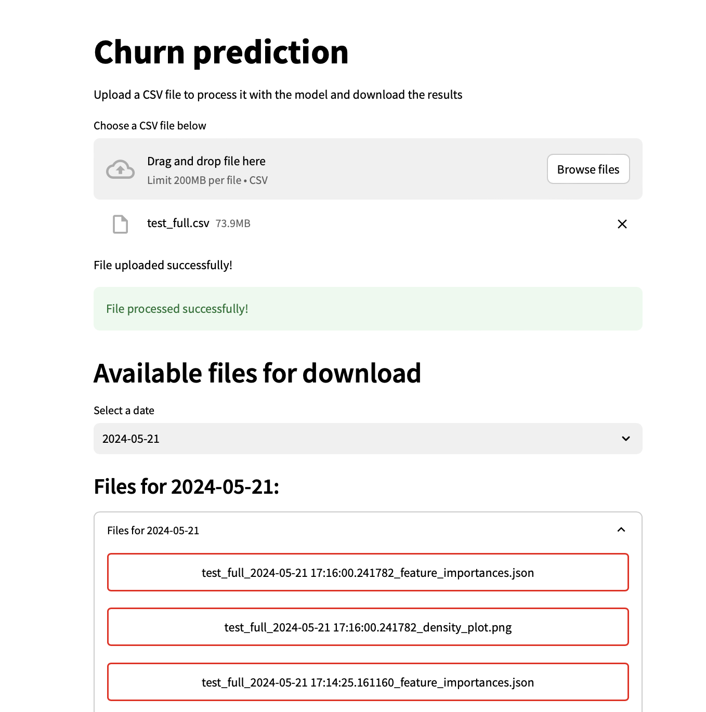

# MLOps-Project

This is an MLOps homework project at the MTS Data Analytics School.

The task is to package your ML model from the [competition](https://www.kaggle.com/competitions/teta-mts-ml-1) of the first ML block homework into the service, which will prepare a file in the format required for sample_submission.

## How to use 

Run the following command in your terminal to build docker image:

```
docker build -t ml_ops_hw_1 .
```

Then create and start container by running the next command:

```
docker run -p 8501:8501 -p 8000:8000 ml_ops_hw_1
```

## Preview

